# UML for LLD Interviews — Working Notes

> Scope: only the UML you actually use in a 45–60 min Low Level Design round. Every diagram has a plain-English walkthrough under it, so you can read the picture even if the notation is new.

---

## 0. The 20% that gets asked

| Diagram | How often in LLD rounds | Use it for |
|---|---|---|
| **Class diagram** | ~90% | The main deliverable. Classes, relationships, patterns. |
| **Sequence diagram** | ~50% | "Walk me through what happens when a user books a slot." |
| **State diagram** | ~20% | Anything with a lifecycle: order, elevator, vending machine, ticket. |
| Activity diagram | rare | Complex branching flow. |
| Use case diagram | rare | Only to list actors at the start. |
| Component / deployment | almost never | That's HLD territory. |

**Rule of thumb:** master the class diagram deeply, sequence diagram well, state diagram enough to draw one. Skip the rest.

### How to read each diagram type — the 30-second version

| Diagram | Boxes are… | Lines are… | Read it… |
|---|---|---|---|
| **Class** | classes | relationships between classes | in any direction — it is a static map, there is no time |
| **Sequence** | objects, side by side at the top | messages (method calls) | **top to bottom** — downward is time passing |
| **State** | states one object can be in | events that move it between states | **follow the arrows** from the filled dot to the ringed dot |

---

## 1. Class diagram — the box

A class is a box with 3 compartments: **name / attributes / methods**.

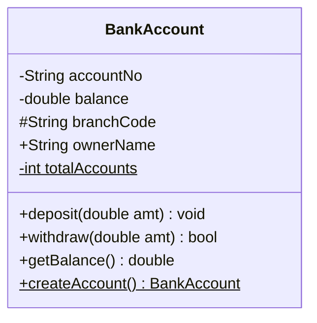
```mermaid
classDiagram
    class BankAccount {
        -String accountNo
        -double balance
        #String branchCode
        +String ownerName
        -int totalAccounts$
        +deposit(double amt) void
        +withdraw(double amt) bool
        +getBalance() double
        +createAccount()$ BankAccount
    }
```

> **How to read it:** one box, split into three strips by horizontal lines.
> The **top strip** is the class name: `BankAccount`.
> The **middle strip** is the data it holds — `accountNo`, `balance`, `branchCode`, `ownerName`, `totalAccounts`.
> The **bottom strip** is what it can do — `deposit`, `withdraw`, `getBalance`, `createAccount`.
> The symbol in front of each line (`-`, `#`, `+`) is who is allowed to touch it, and the text after the `)` is the return type. `totalAccounts` and `createAccount()` are underlined, which means they belong to the class itself, not to one account.

### Visibility symbols

| Symbol | Means | Java keyword |
|---|---|---|
| `+` | public | `public` |
| `-` | private | `private` |
| `#` | protected | `protected` |
| `~` | package / default | (no keyword) |

### Special markers

| Marker | Meaning | Mermaid |
|---|---|---|
| _italics_ or `<<abstract>>` | abstract class / method | `class X { <<abstract>> }` or `+area()* double` |
| <u>underline</u> | static member | `-count$ int` |
| `<<interface>>` | interface | `class X { <<interface>> }` |
| `<<enumeration>>` | enum | `class X { <<enumeration>> }` |

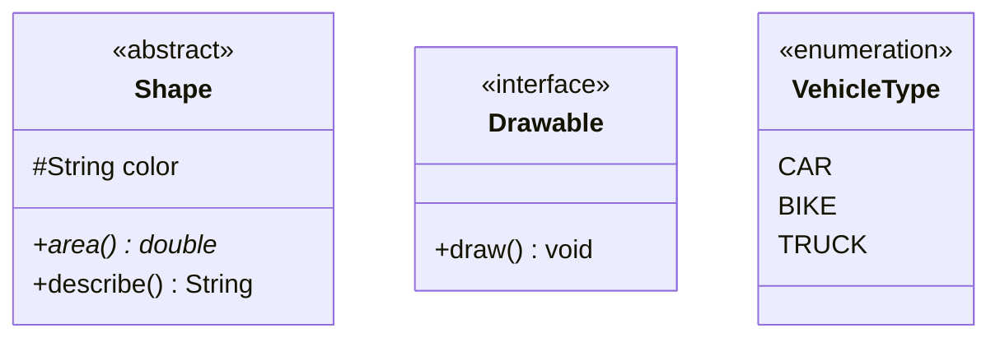
```mermaid
classDiagram
    class Shape {
        <<abstract>>
        #String color
        +area()* double
        +describe() String
    }
    class Drawable {
        <<interface>>
        +draw() void
    }
    class VehicleType {
        <<enumeration>>
        CAR
        BIKE
        TRUCK
    }
```

> **How to read it:** three separate boxes, not connected — they are just three examples of labelling.
> **Box 1** `Shape` is tagged `<<abstract>>`, so you cannot create a `Shape` directly. Its `area()` is in italics, meaning it has no body — every child must write its own.
> **Box 2** `Drawable` is tagged `<<interface>>`: only a method signature, no data.
> **Box 3** `VehicleType` is tagged `<<enumeration>>`, so the middle strip lists the only allowed values: `CAR`, `BIKE`, `TRUCK`.

**Interview habit:** don't dump every getter/setter. Write only the methods that carry behaviour. An interviewer reads `+park(Vehicle v) Ticket` as design; `+getName()` as noise.

---

## 2. Relationships — the part they judge you on

All six in one picture:

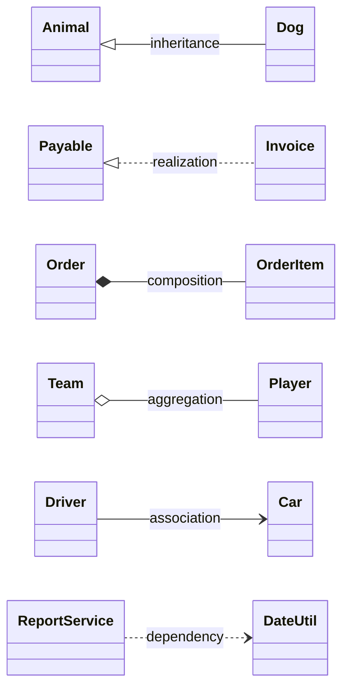
```mermaid
classDiagram
    direction LR
    Animal <|-- Dog : inheritance
    Payable <|.. Invoice : realization
    Order *-- OrderItem : composition
    Team o-- Player : aggregation
    Driver --> Car : association
    ReportService ..> DateUtil : dependency
```

> **How to read it:** six unrelated pairs of boxes stacked on top of each other, one pair per relationship type. The word in the middle of each line names the relationship. Compare the **line endings**, that is the only thing that differs:
> **1.** `Dog → Animal`: solid line, hollow triangle at Animal — inheritance.
> **2.** `Invoice → Payable`: dashed line, hollow triangle — realization (implements).
> **3.** `Order — OrderItem`: filled diamond at Order — composition.
> **4.** `Team — Player`: hollow diamond at Team — aggregation.
> **5.** `Driver → Car`: plain arrow — association.
> **6.** `ReportService → DateUtil`: dashed arrow — dependency.
> The next six subsections take these one at a time.

### 2.1 Inheritance (Generalization) — "is-a"

Hollow triangle, solid line, pointing to the parent.

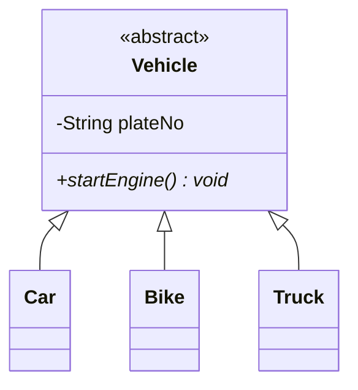
```mermaid
classDiagram
    class Vehicle {
        <<abstract>>
        -String plateNo
        +startEngine()* void
    }
    Vehicle <|-- Car
    Vehicle <|-- Bike
    Vehicle <|-- Truck
```

> **How to read it:** `Vehicle` sits at the top with three boxes below it — `Car`, `Bike`, `Truck`. Each child has a line going up to `Vehicle`, ending in a **hollow triangle that touches the parent**. The triangle always points at the parent, so you can tell which class is the general one just by looking at where the triangles land. All three children inherit `plateNo` and must supply their own `startEngine()`, because it is abstract in the parent.

Say it as: *"Car **is a** Vehicle."*
Mermaid: `Parent <|-- Child`

### 2.2 Realization — "implements"

Hollow triangle, **dashed** line. Class implements an interface.

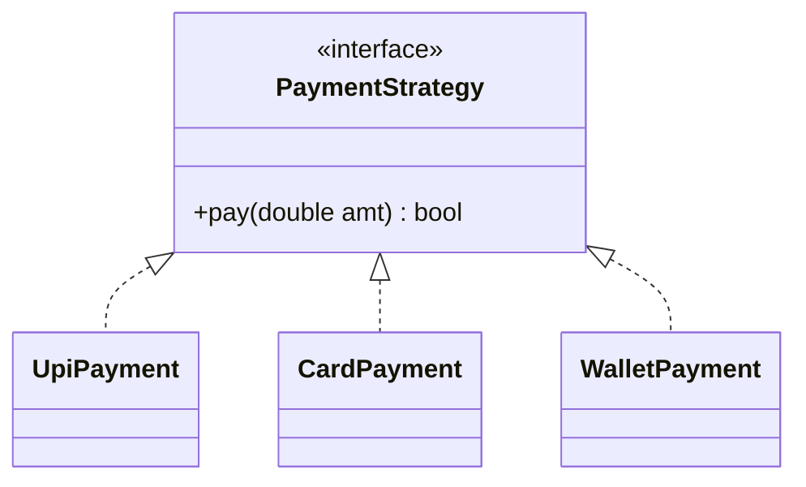
```mermaid
classDiagram
    class PaymentStrategy {
        <<interface>>
        +pay(double amt) bool
    }
    PaymentStrategy <|.. UpiPayment
    PaymentStrategy <|.. CardPayment
    PaymentStrategy <|.. WalletPayment
```

> **How to read it:** identical shape to the inheritance picture above — one box on top, three below, triangles pointing up. The **only** difference is that the lines are **dashed** and the top box is tagged `<<interface>>`. Dashed + triangle means "I promise to provide these methods", so `UpiPayment`, `CardPayment` and `WalletPayment` each write their own `pay()`.

Say it as: *"UpiPayment **implements** PaymentStrategy."*
Mermaid: `Interface <|.. Class`

> Dashed line = "not a real inheritance of code, only a contract." Easy way to remember: dashed = promise.

### 2.3 Composition — "part-of, and it dies with me"

**Filled** diamond on the **whole** side.

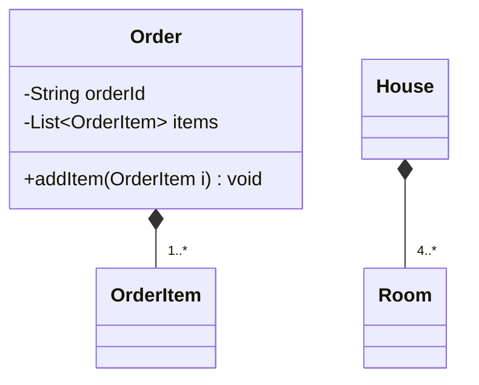
```mermaid
classDiagram
    Order *-- "1..*" OrderItem
    House *-- "4..*" Room
    class Order {
        -String orderId
        -List~OrderItem~ items
        +addItem(OrderItem i) void
    }
```

> **How to read it:** two pairs. In the first, a line joins `Order` and `OrderItem` with a **solid black diamond touching `Order`** and `1..*` written near `OrderItem`. That reads as: one order owns one or more order items, and it owns them completely. The second pair says the same thing for `House` and `Room` (4 or more rooms). The `Order` box below also shows the field that makes it real: `List<OrderItem> items`. **The diamond always sits on the owner.**

- The part cannot exist alone.
- The whole creates it, the whole destroys it.
- Delete the Order → OrderItems are meaningless.

Mermaid: `Whole *-- Part`

### 2.4 Aggregation — "part-of, but it survives without me"

**Hollow** diamond on the whole side.

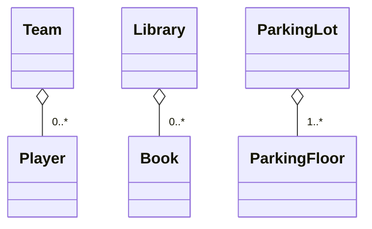
```mermaid
classDiagram
    Team o-- "0..*" Player
    Library o-- "0..*" Book
    ParkingLot o-- "1..*" ParkingFloor
```

> **How to read it:** same layout as composition, but every diamond is **hollow (white inside)**. Three independent pairs: a team has zero or more players, a library has zero or more books, a parking lot has one or more floors. Hollow means the part keeps existing if the owner disappears — delete the team and the players are still players.

Mermaid: `Whole o-- Part`

#### The one test that settles it

> **"If I delete the container, must the part be deleted too?"**
> Yes → composition (filled ◆). No → aggregation (hollow ◇).

| | Composition | Aggregation |
|---|---|---|
| Diamond | filled ◆ | hollow ◇ |
| Lifetime | part dies with whole | part outlives whole |
| Sharing | not shared | can be shared |
| In code | `new` inside the class | passed into constructor / setter |
| Example | Order → OrderItem | Team → Player |

**Honest note:** most interviewers accept either if your reasoning is sound. Say the reason out loud — "I made it composition because a ParkingSpot has no meaning outside a floor" — and you're fine.

### 2.5 Association — "uses / knows about, long term"

Plain solid line. Arrow if only one side knows the other.

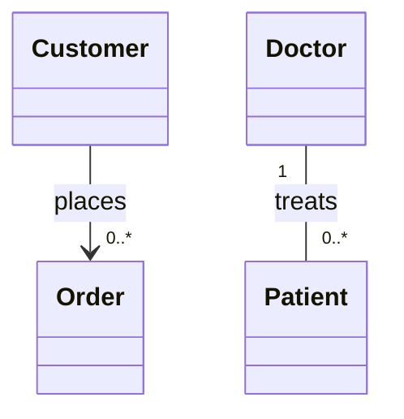
```mermaid
classDiagram
    Customer --> "0..*" Order : places
    Doctor "1" -- "0..*" Patient : treats
```

> **How to read it:** two pairs, and the difference between them is the arrowhead.
> **Pair 1:** `Customer → Order` has an arrowhead pointing at `Order` and the label `places`. One-way: the customer holds a list of orders, but an order does not hold the customer.
> **Pair 2:** `Doctor — Patient` has **no arrowhead** and the label `treats`. Two-way: each can reach the other. The `1` and `0..*` at the ends say one doctor treats any number of patients.

- One-way: `A --> B` (A holds a reference to B)
- Two-way: `A -- B` (both hold references)
- Put a **verb label** on it: `places`, `treats`, `owns`.

### 2.6 Dependency — "uses temporarily"

**Dashed** arrow. B appears as a method parameter, local variable, or return type — not a field.

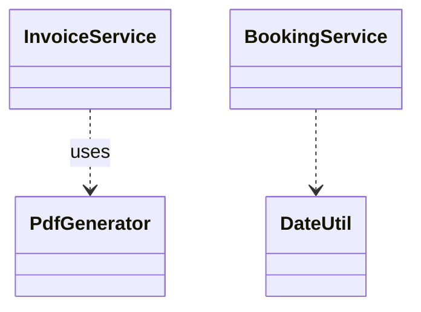
```mermaid
classDiagram
    InvoiceService ..> PdfGenerator : uses
    BookingService ..> DateUtil
```

> **How to read it:** two pairs joined by **dashed lines with a small open arrowhead** — no diamond, no triangle. This is the weakest link on a class diagram. It means `InvoiceService` mentions `PdfGenerator` somewhere inside a method, but does not store one as a field. If you deleted the dashed line, only one method would stop compiling.

Say it as: *"InvoiceService **uses** PdfGenerator inside one method."*

### Quick decision flow

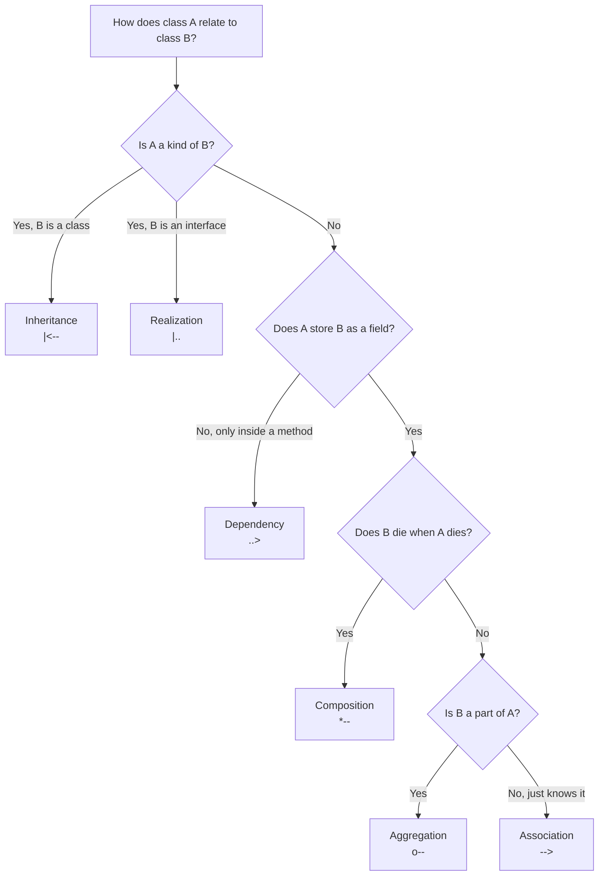
```mermaid
flowchart TD
    A["How does class A relate to class B?"] --> B{"Is A a kind of B?"}
    B -->|Yes, B is a class| C["Inheritance<br/>|<--"]
    B -->|Yes, B is an interface| D["Realization<br/>|.."]
    B -->|No| E{"Does A store B as a field?"}
    E -->|No, only inside a method| F["Dependency<br/>..>"]
    E -->|Yes| G{"Does B die when A dies?"}
    G -->|Yes| H["Composition<br/>*--"]
    G -->|No| I{"Is B a part of A?"}
    I -->|Yes| J["Aggregation<br/>o--"]
    I -->|No, just knows it| K["Association<br/>-->"]
```

> **How to read it:** this is a flowchart, not UML — start at the top box and follow the labelled arrows. Diamonds are yes/no questions; rectangles are answers.
> Ask "is A a kind of B?" — yes and B is a class → **inheritance**; yes and B is an interface → **realization**.
> If no, ask "does A store B as a field?" — no → **dependency**.
> If yes, ask "does B die when A dies?" — yes → **composition**; no → then ask "is B a part of A?" — yes → **aggregation**, no → **association**.
> Four questions, and you land on exactly one of the six.

---

## 3. Multiplicity — the numbers on the line

| Notation | Meaning |
|---|---|
| `1` | exactly one |
| `0..1` | optional, at most one |
| `*` or `0..*` | zero or many |
| `1..*` | at least one |
| `2..4` | between 2 and 4 |

Read it **towards** the class it sits next to:

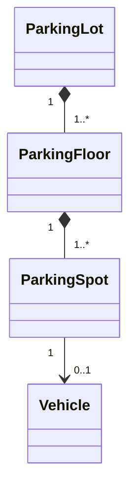
```mermaid
classDiagram
    ParkingLot "1" *-- "1..*" ParkingFloor
    ParkingFloor "1" *-- "1..*" ParkingSpot
    ParkingSpot "1" --> "0..1" Vehicle
```

> **How to read it:** a chain of four boxes, top to bottom: `ParkingLot → ParkingFloor → ParkingSpot → Vehicle`. The small numbers sit at the two ends of each line and are read towards the box they are next to.
> Line 1: one lot, one-or-more floors, filled diamond → the lot owns its floors.
> Line 2: one floor, one-or-more spots, filled diamond → the floor owns its spots.
> Line 3: one spot, **zero or one** vehicle, plain arrow → a spot may be empty, and it does not own the car parked in it.
> The `0..1` on that last line is the whole point: it is what makes "empty spot" a legal state.

**Interviewers do check this.** Missing multiplicity is the most common silent mark-down.

---

## 4. Sequence diagram — "what happens when…"

A sequence diagram is not a map, it is a **timeline**. Before reading one, know these four things:

1. The boxes across the **top** are the objects taking part. Nothing about them is drawn — only the fact that they exist.
2. The dotted line hanging under each box is its **lifeline**. Going **down the page means time passing**.
3. Each horizontal arrow is **one method call**, from the caller to the receiver. Read them strictly top to bottom, like steps in a recipe.
4. The thin vertical bar on a lifeline means that object is **busy right now** — it was called and has not returned yet.

### Notation

| Element | Meaning | Mermaid |
|---|---|---|
| Lifeline | the object, dotted line downward | `participant X` |
| Activation bar | object is doing work | `activate X` / `deactivate X` |
| Solid arrow ▶ | synchronous call | `A->>B: method()` |
| Dashed arrow ◁ | return value | `B-->>A: result` |
| Open arrow | async / fire-and-forget | `A-)B: notify()` |
| `alt / else` | if-else | `alt cond ... else ... end` |
| `opt` | optional block | `opt cond ... end` |
| `loop` | repetition | `loop each item ... end` |

### Example — book a parking spot

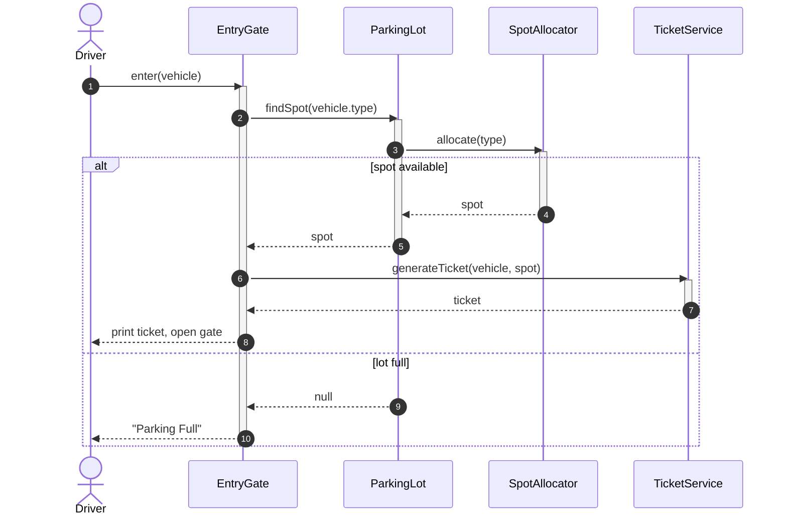
```mermaid
sequenceDiagram
    autonumber
    actor D as Driver
    participant G as EntryGate
    participant L as ParkingLot
    participant S as SpotAllocator
    participant T as TicketService

    D->>G: enter(vehicle)
    activate G
    G->>L: findSpot(vehicle.type)
    activate L
    L->>S: allocate(type)
    activate S
    alt spot available
        S-->>L: spot
        deactivate S
        L-->>G: spot
        deactivate L
        G->>T: generateTicket(vehicle, spot)
        activate T
        T-->>G: ticket
        deactivate T
        G-->>D: print ticket, open gate
    else lot full
        L-->>G: null
        G-->>D: "Parking Full"
    end
    deactivate G
```

> **How to read it:** five participants across the top — a stick figure `Driver`, then `EntryGate`, `ParkingLot`, `SpotAllocator`, `TicketService`. Follow the numbered arrows downward:
> **1.** The driver calls `enter(vehicle)` on the entry gate.
> **2.** The gate asks the parking lot to `findSpot(vehicle.type)`.
> **3.** The lot forwards that to the spot allocator as `allocate(type)`.
> Now the big pink box labelled **`alt`** takes over. `alt` means "alternative" — **only one** of the two halves actually runs, and the condition in square brackets tells you which.
> **Top half `[spot available]`:** **4.** the allocator returns a `spot` (dashed arrow = a return, not a new call), **5.** the lot passes it back to the gate, **6.** the gate asks `TicketService` to `generateTicket`, **7.** the ticket comes back, **8.** the gate prints it and opens for the driver.
> **Bottom half `[lot full]`:** **9.** the lot returns `null`, **10.** the gate tells the driver "Parking Full".
> The yellow bars show who is busy: `EntryGate` is busy the whole time, because it is waiting on everyone it called.

### Example — payment with retry

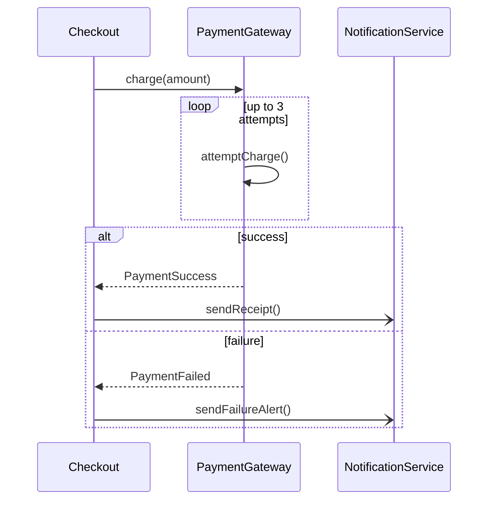
```mermaid
sequenceDiagram
    participant C as Checkout
    participant P as PaymentGateway
    participant N as NotificationService

    C->>P: charge(amount)
    loop up to 3 attempts
        P->>P: attemptCharge()
    end
    alt success
        P-->>C: PaymentSuccess
        C-)N: sendReceipt()
    else failure
        P-->>C: PaymentFailed
        C-)N: sendFailureAlert()
    end
```

> **How to read it:** three participants — `Checkout`, `PaymentGateway`, `NotificationService`.
> `Checkout` calls `charge(amount)` on the gateway.
> The first pink box is a **`loop`**, labelled `[up to 3 attempts]`. Everything inside it repeats. Inside there is only one arrow, `attemptCharge()`, and it **curves back into the same lifeline** — that is an object calling its own method, not talking to anyone else.
> The second pink box is an **`alt`**, so exactly one half runs. On `[success]` the gateway returns `PaymentSuccess` and checkout fires `sendReceipt()`. On `[failure]` it returns `PaymentFailed` and fires `sendFailureAlert()`.
> The two arrows into `NotificationService` are **open-headed** — fire and forget. Checkout does not wait for the email to be sent.

**Interview habit:** draw the sequence diagram for **one happy path + one failure path**. Not more. It proves you thought about errors without eating your time.

---

## 5. State diagram — for anything with a lifecycle

Use when the object behaves differently depending on what state it is in. This is the hint that the **State pattern** may be expected.

Three symbols to know before reading one:

- **Filled dot** = where the object starts.
- **Rounded box** = one state the object can be sitting in.
- **Arrow with a label** = an event that moves it; the label is what happened, not what the object did.
- **Ringed dot (◎)** = the object's life is over.

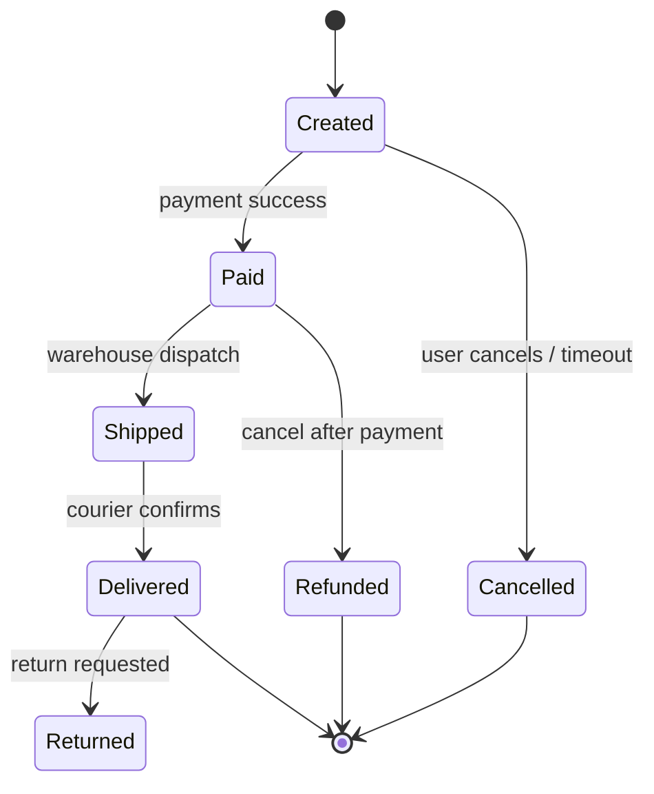
```mermaid
stateDiagram-v2
    [*] --> Created
    Created --> Paid: payment success
    Created --> Cancelled: user cancels / timeout
    Paid --> Shipped: warehouse dispatch
    Shipped --> Delivered: courier confirms
    Delivered --> Returned: return requested
    Paid --> Refunded: cancel after payment
    Cancelled --> [*]
    Delivered --> [*]
    Refunded --> [*]
```

> **How to read it — this is an order's life:** start at the filled dot at the top; the order is `Created`.
> From `Created` there are **two** ways out: pay successfully → `Paid`, or cancel / time out → `Cancelled`.
> From `Paid` there are also two: the warehouse dispatches it → `Shipped`, or the customer cancels after paying → `Refunded`.
> From `Shipped`, the courier confirms → `Delivered`. From `Delivered`, a return can be requested → `Returned`.
> The arrows into the ringed dot at the bottom (`Cancelled`, `Delivered`, `Refunded`) mean the order is finished.
> The useful reading is the arrows that are **missing**: there is no line from `Created` to `Shipped`, so you can never ship an unpaid order. A state diagram is really a list of the transitions you are allowed to make.

Vending machine (classic LLD question):

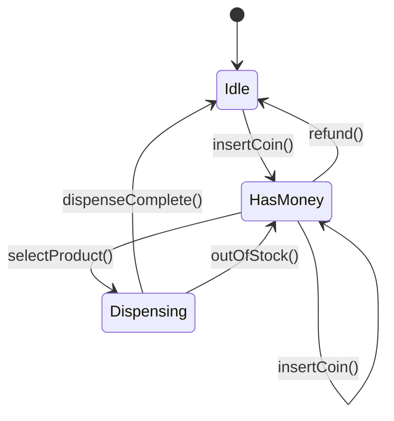
```mermaid
stateDiagram-v2
    [*] --> Idle
    Idle --> HasMoney: insertCoin()
    HasMoney --> HasMoney: insertCoin()
    HasMoney --> Dispensing: selectProduct()
    HasMoney --> Idle: refund()
    Dispensing --> Idle: dispenseComplete()
    Dispensing --> HasMoney: outOfStock()
```

> **How to read it:** three states — `Idle`, `HasMoney`, `Dispensing` — and the machine loops between them forever, so there is no end dot.
> Start at the filled dot: the machine is `Idle`.
> `insertCoin()` → `HasMoney`.
> From `HasMoney`, **`insertCoin()` points back to `HasMoney` itself** — a self-loop, meaning adding another coin keeps you in the same state with more credit.
> `selectProduct()` → `Dispensing`; or `refund()` → back to `Idle`.
> From `Dispensing`, `dispenseComplete()` → back to `Idle`, or `outOfStock()` → back to `HasMoney` so the user can pick something else.
> Same trick as before: notice you cannot go from `Idle` straight to `Dispensing`. No coin, no product.

Notation: `[*]` = start/end, arrow label = **event / trigger**, box = state.

---

## 6. Design patterns as UML — what interviewers expect to see

LLD rounds are pattern rounds in disguise. Know how these three look on paper.

### Strategy — swap the algorithm

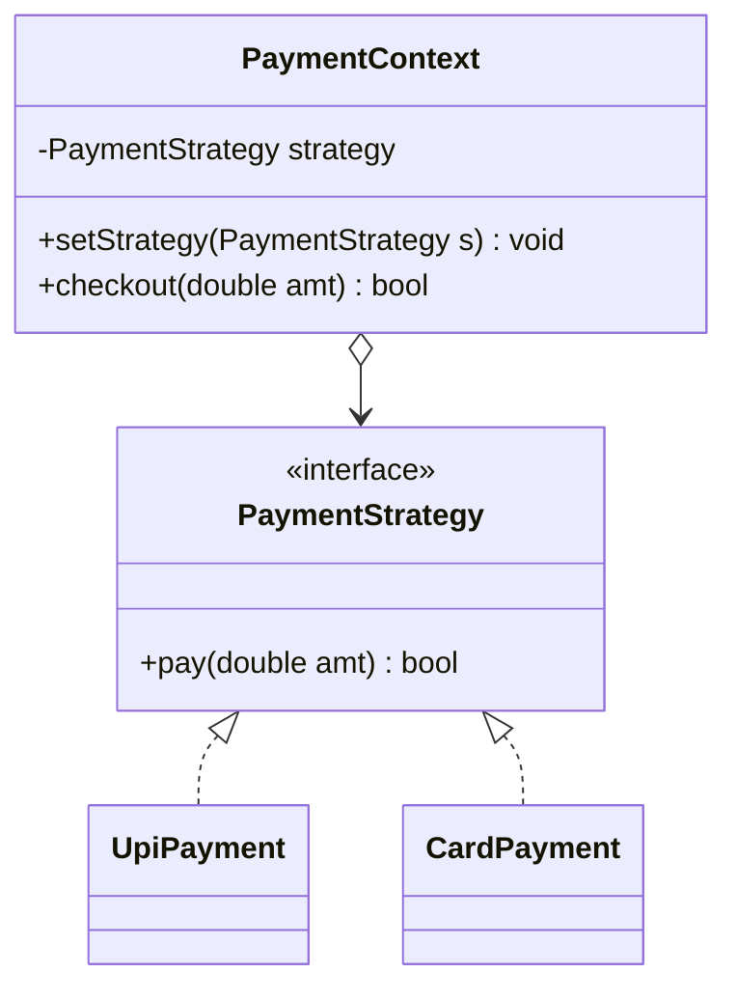
```mermaid
classDiagram
    class PaymentStrategy {
        <<interface>>
        +pay(double amt) bool
    }
    class PaymentContext {
        -PaymentStrategy strategy
        +setStrategy(PaymentStrategy s) void
        +checkout(double amt) bool
    }
    PaymentContext o--> PaymentStrategy
    PaymentStrategy <|.. UpiPayment
    PaymentStrategy <|.. CardPayment
```

> **How to read it:** `PaymentContext` at the top holds a field of type `PaymentStrategy` — the hollow diamond arrow between them says "has-a, but does not own it".
> Below the interface, `UpiPayment` and `CardPayment` hang off it with dashed triangles, meaning both implement `pay()`.
> The thing to notice: there is **no line at all** from `PaymentContext` to `UpiPayment` or `CardPayment`. The context only ever touches the interface, which is why you can add a third payment type without redrawing anything above it.

### Factory — hide the object creation

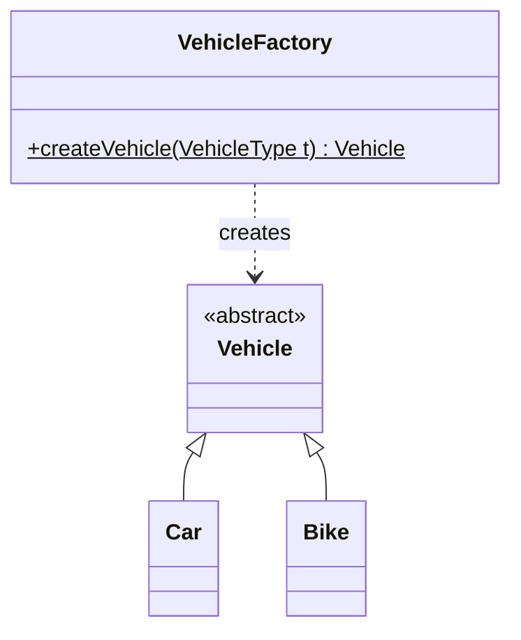
```mermaid
classDiagram
    class VehicleFactory {
        +createVehicle(VehicleType t)$ Vehicle
    }
    class Vehicle {
        <<abstract>>
    }
    VehicleFactory ..> Vehicle : creates
    Vehicle <|-- Car
    Vehicle <|-- Bike
```

> **How to read it:** `VehicleFactory` has one underlined (static) method, `createVehicle`, which returns a `Vehicle`.
> The **dashed arrow** labelled `creates` from the factory to `Vehicle` is a dependency — the factory does not keep vehicles, it just makes them and hands them over.
> `Car` and `Bike` sit under `Vehicle` with solid triangles (inheritance). So the caller asks the factory for a vehicle and receives a `Car` or a `Bike` without ever writing `new Car()`.

### Observer — notify many listeners

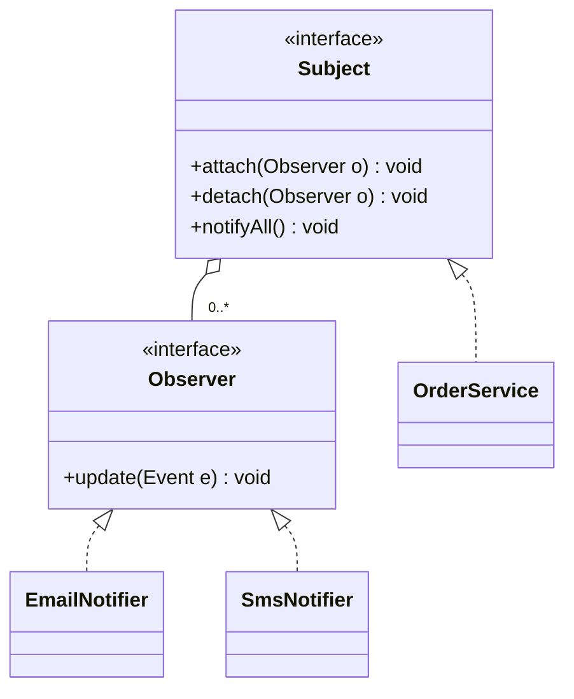
```mermaid
classDiagram
    class Subject {
        <<interface>>
        +attach(Observer o) void
        +detach(Observer o) void
        +notifyAll() void
    }
    class Observer {
        <<interface>>
        +update(Event e) void
    }
    Subject o-- "0..*" Observer
    Subject <|.. OrderService
    Observer <|.. EmailNotifier
    Observer <|.. SmsNotifier
```

> **How to read it:** two interfaces side by side. `Subject` has `attach`, `detach`, `notifyAll`; `Observer` has a single `update`.
> The hollow-diamond line between them, marked `0..*`, means one subject keeps a list of any number of observers.
> Underneath, `OrderService` implements `Subject`, while `EmailNotifier` and `SmsNotifier` implement `Observer`.
> Read it as a sentence: *`OrderService` holds a list of things that can be `update()`d, and both notifiers qualify.* It has no idea an email or an SMS is involved.

The shape to internalise: **interface at top, concrete classes realizing it below, context holding the interface (not the concrete class)**. That single shape covers Strategy, Observer, State, Command, and Decorator.

---

## 7. Full worked example — Parking Lot

The most repeated LLD question. Keep this as your template.

### Class diagram

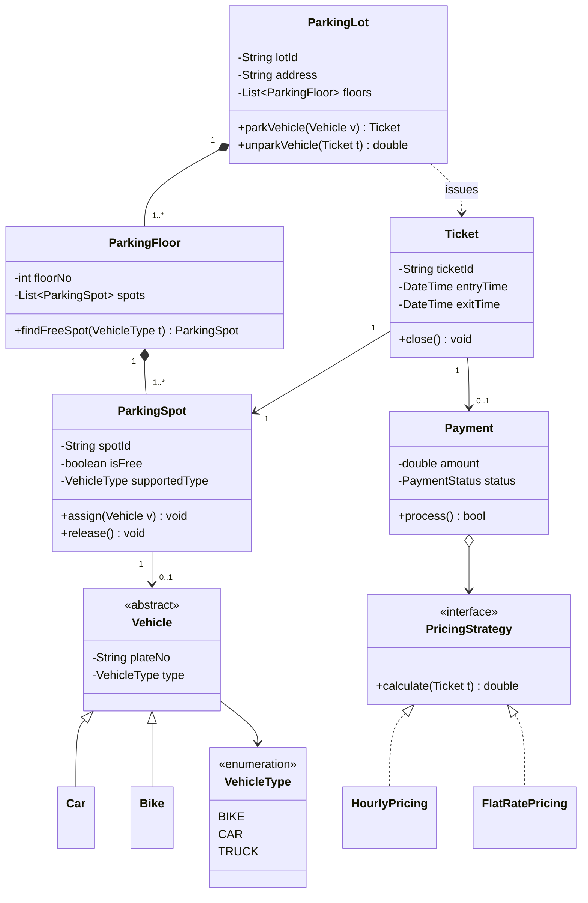
```mermaid
classDiagram
    direction TB

    class ParkingLot {
        -String lotId
        -String address
        -List~ParkingFloor~ floors
        +parkVehicle(Vehicle v) Ticket
        +unparkVehicle(Ticket t) double
    }

    class ParkingFloor {
        -int floorNo
        -List~ParkingSpot~ spots
        +findFreeSpot(VehicleType t) ParkingSpot
    }

    class ParkingSpot {
        -String spotId
        -boolean isFree
        -VehicleType supportedType
        +assign(Vehicle v) void
        +release() void
    }

    class Vehicle {
        <<abstract>>
        -String plateNo
        -VehicleType type
    }

    class VehicleType {
        <<enumeration>>
        BIKE
        CAR
        TRUCK
    }

    class Ticket {
        -String ticketId
        -DateTime entryTime
        -DateTime exitTime
        +close() void
    }

    class PricingStrategy {
        <<interface>>
        +calculate(Ticket t) double
    }

    class Payment {
        -double amount
        -PaymentStatus status
        +process() bool
    }

    ParkingLot "1" *-- "1..*" ParkingFloor
    ParkingFloor "1" *-- "1..*" ParkingSpot
    ParkingSpot "1" --> "0..1" Vehicle
    Vehicle <|-- Car
    Vehicle <|-- Bike
    Vehicle --> VehicleType
    ParkingLot ..> Ticket : issues
    Ticket "1" --> "1" ParkingSpot
    Ticket "1" --> "0..1" Payment
    PricingStrategy <|.. HourlyPricing
    PricingStrategy <|.. FlatRatePricing
    Payment o--> PricingStrategy
```

> **How to read it — go through it in three groups instead of all at once:**
> **Group 1, the physical structure (left spine):** `ParkingLot` → `ParkingFloor` → `ParkingSpot`, joined by **filled diamonds**, so the lot owns floors and each floor owns spots. From `ParkingSpot` a plain arrow with `0..1` points at `Vehicle` — a spot may hold one car or none, and it does not own the car. `Car` and `Bike` inherit from `Vehicle` (solid triangles), and `Vehicle` points at the `VehicleType` enum.
> **Group 2, the paperwork (middle):** `ParkingLot` has a **dashed** arrow to `Ticket` labelled `issues` — it creates tickets but does not store them. Each `Ticket` points at exactly one `ParkingSpot` (so you know where the car is) and at `0..1` `Payment` (unpaid until exit).
> **Group 3, the money (right):** `PricingStrategy` is an interface with `HourlyPricing` and `FlatRatePricing` under it on dashed triangles. `Payment` holds a `PricingStrategy` via a hollow diamond, so the fee rule can be swapped without touching `Payment`.
> **The takeaway:** every class has one job. The lot arranges space, the ticket records a visit, the payment settles money, and the pricing rule is pluggable. That separation is what earns marks, not the number of boxes.

### Exit flow — sequence

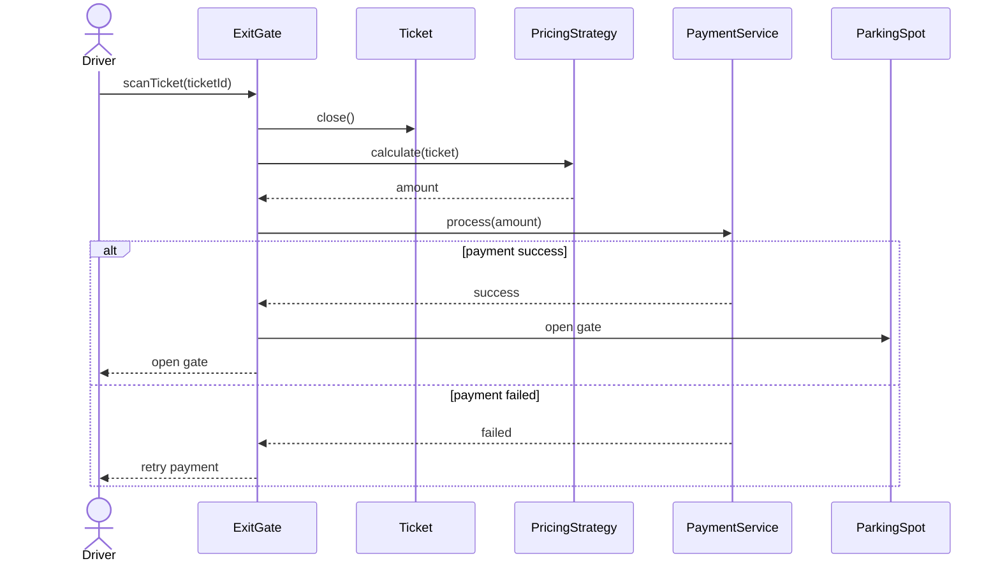
```mermaid
sequenceDiagram
    actor D as Driver
    participant X as ExitGate
    participant T as Ticket
    participant P as PricingStrategy
    participant Pay as PaymentService
    participant S as ParkingSpot

    D->>X: scanTicket(ticketId)
    X->>T: close()
    X->>P: calculate(ticket)
    P-->>X: amount
    X->>Pay: process(amount)
    alt payment success
        Pay-->>X: success
        X->>S: open gate
        X-->>D: open gate
    else payment failed
        Pay-->>X: failed
        X-->>D: retry payment
    end
```

> **How to read it — the driver is leaving:**
> The driver scans the ticket at the `ExitGate`.
> The gate tells the `Ticket` to `close()`, which stamps the exit time.
> The gate asks the `PricingStrategy` to `calculate(ticket)`; the dashed arrow back carries the `amount`.
> The gate hands that amount to `PaymentService.process()`.
> Then the `alt` box splits: on **success** the spot is released and the gate opens; on **failure** the driver is asked to retry.
> Read left to right and you can see who is in charge — every arrow starts at `ExitGate`. It is the coordinator, and the other objects each do one small thing.

### Ticket lifecycle — state

```mermaid
stateDiagram-v2
    [*] --> Active: vehicle parked
    Active --> PaymentPending: scanned at exit
    PaymentPending --> Paid: payment success
    PaymentPending --> PaymentPending: retry
    Paid --> Closed: gate opened
    Closed --> [*]
```

> **How to read it:** one straight line down with a single detour.
> A ticket is born `Active` when the car parks. Scanning at exit moves it to `PaymentPending`. From there, success → `Paid`; if payment fails, the **self-loop labelled `retry`** keeps it in `PaymentPending` — that loop is how you say "you may try again as many times as you like". Once paid, opening the gate moves it to `Closed`, and the ringed dot ends its life.
> Notice again what is impossible: you cannot go from `Active` straight to `Closed`, so no car leaves without going through payment.

---

## 8. Mermaid cheat sheet — copy while practising

```
classDiagram
    Parent    <|--  Child        %% inheritance
    Interface <|..  Impl         %% realization
    Whole     *--   Part         %% composition (filled)
    Whole     o--   Part         %% aggregation (hollow)
    A         -->   B            %% association (directed)
    A         --    B            %% association (plain)
    A         ..>   B            %% dependency

    A "1" --> "0..*" B : label   %% multiplicity + verb

    class X {
        <<interface>>
        -privateField int
        +publicMethod() String
        +abstractMethod()* void
        +staticMethod()$ void
        -List~Item~ items
    }
```

```
sequenceDiagram
    participant A
    actor U
    A->>B: sync call
    B-->>A: return
    A-)B: async call
    activate B / deactivate B
    alt cond ... else ... end
    opt cond ... end
    loop label ... end
    Note over A,B: comment
```

```
stateDiagram-v2
    [*] --> S1
    S1 --> S2: event
    S2 --> [*]
```

Note: generics use tilde — `List~OrderItem~`, not angle brackets.

---

## 9. How to spend the interview

```mermaid
flowchart LR
    A["1. Clarify<br/>5 min"] --> B["2. Requirements<br/>+ actors<br/>5 min"]
    B --> C["3. Identify classes<br/>from nouns<br/>5 min"]
    C --> D["4. Class diagram<br/>+ relationships<br/>15 min"]
    D --> E["5. Sequence for<br/>main flow<br/>10 min"]
    E --> F["6. Patterns +<br/>extensibility<br/>5 min"]
    F --> G["7. Code the<br/>core classes<br/>if asked"]
```

> **How to read it:** a straight left-to-right chain — seven steps with the minutes to spend on each. Clarify (5), requirements and actors (5), pull out classes (5), draw the class diagram (15), one sequence diagram (10), patterns and extensibility (5), then code if they ask. The first fifteen minutes are all talking and listing; only then do you start drawing.

**The noun-verb trick:** write the requirements in plain sentences. Nouns → candidate classes. Verbs → candidate methods. Adjectives → attributes or enums. It takes two minutes and gives you a first-cut class list you can defend.

Always narrate while drawing. A silent correct diagram scores lower than a spoken-through decent one.

---

## 10. Mistakes that cost marks

1. **No multiplicity** on any line. Add at least `1`, `0..*` on the important ones.
2. **Every relationship drawn as a plain arrow.** Shows you don't know the difference.
3. **Diamond on the wrong side.** The diamond always sits on the **whole/owner**.
4. **God class** — one `ParkingLotManager` doing everything. Split by responsibility.
5. **Concrete classes wired to concrete classes.** Depend on the interface instead.
6. **Filling boxes with getters/setters** and no real behaviour.
7. **Forgetting enums** for fixed sets (status, type, size) — cheap way to look precise.
8. **Skipping the failure path** in the sequence diagram.
9. **Using `<<interface>>` and then giving it fields.** Interfaces have no state.
10. **Not saying trade-offs.** "I chose composition here because…" is what they're listening for.

---

## 11. Self-check

Answer these without looking up:

1. Filled diamond vs hollow diamond — which one, and on which side?
2. Difference between `..>` and `-->` in one sentence.
3. What does a dashed line with a hollow triangle mean?
4. `Order "1" *-- "1..*" OrderItem` — read it out in English.
5. In a sequence diagram, what does an `alt` box mean, and how many of its halves run?
6. What is an arrow that curves back into the same lifeline?
7. In a state diagram, what does a self-loop on a state tell you?
8. Which diagram would you draw for an elevator, and why?
9. Name the pattern: interface at top, three concrete classes below it, context holds a reference to the interface and can swap it at runtime.

## 12. Practice set

Draw class + sequence + (state where it applies):

- Parking Lot ✔ (done above)
- Elevator system — state diagram is the heart of it
- Splitwise / expense sharing — strategy for split types
- BookMyShow seat booking — concurrency + state
- ATM machine — state pattern
- Vending machine — state pattern
- Chess / Tic-Tac-Toe — inheritance for pieces
- Logging framework — chain of responsibility
- Notification service — observer + factory
- Rate limiter — strategy

Do two a week, draw before you code, and time yourself at 40 minutes.
